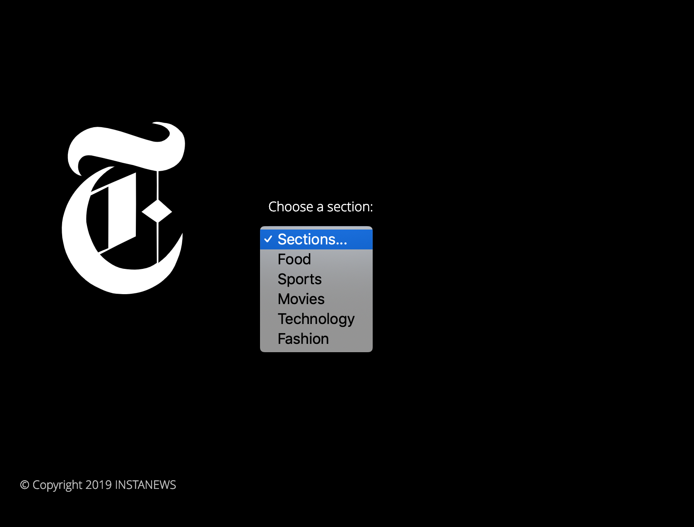
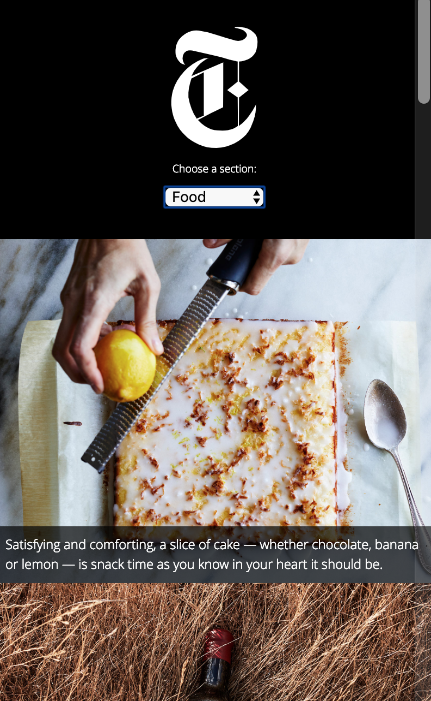

# Project 2

This project is a one-page responsive website, as part of the Web development program at RED Academy. This website appling Sass and API. It can request content using the New York Times API and the styling was built using Sass preprocessing. Some transitions or animations are also added between UIs.

## Usage

On the home page, there is a drop-down menu. You can select topics, and the page will list 12 articles related to the chosen topic when you make selections. The materials are from the New York Times API.

## Skills learned

In this project, I learned how to write clear and effective code using sass. I can use APIs to request JSON information from servers and get the target information from the JSON object. Also, I can dynamically update the content with the jQuery to avoid reloading the whole page.  

* HTML
* Sass
* Ajax
* JSON
* Gulp
* Eslint
* JavaScript
* jQuery
* Responsive Web design
* Git
* Linux Command line skill

## Overview
### Home page

### Desktop size

### Tablet size

### Mobile size
